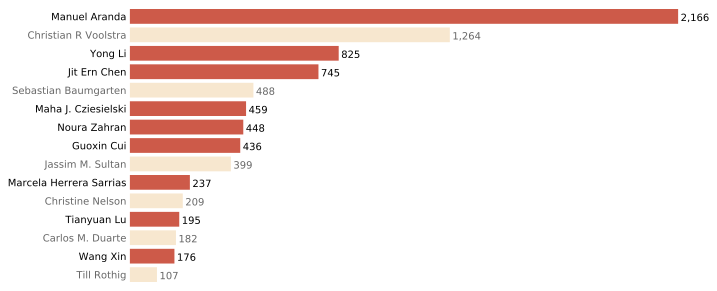
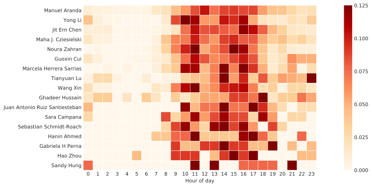
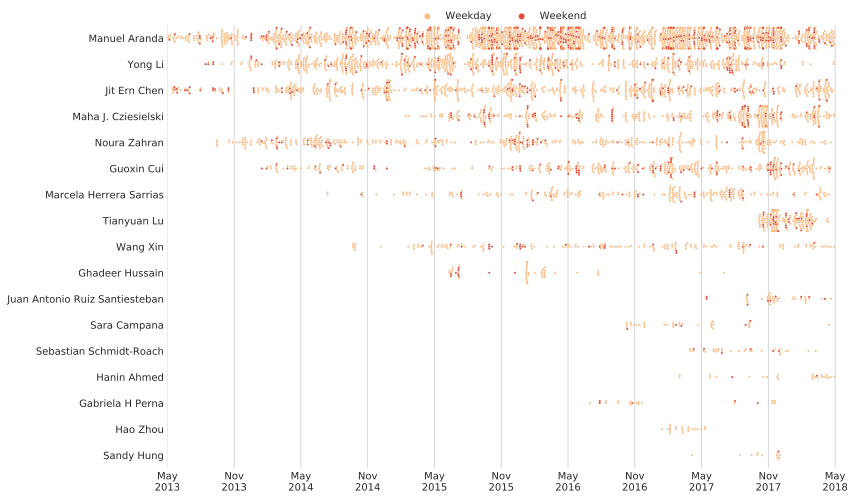

# email_analysis: who's pestering me the most at work? #

## How to get raw data ##
I use an email client (Outlook 2016) to check my organisational email, which in turn is hosted on Gmail. After trawling the depths of the internet trying to find the best way to export the sender/subject title/date of each email in my inbox, the answer was deceptively simple: select all emails with CTRL+A, CTRL+C, go to Excel/Notepad++, CTRL+V. Seriously. -__-"

I saved the tab-delimited raw data as inbox.tsv (not available here for privacy concerns).

## How to use the scripts ##
The scripts use hardcoded filenames because I'm laaaaaazy.

1. Run parse_inbox.py on the tab-delimited raw data and call the output "inbox.parsed.tsv". This file contains \<name\> \t \<list of comma-spaced UNIX times of the emails\>
2. Run the plotting scripts in any order.

## zzz. Just gimme results! ##

Senders, sorted by volume:

Aranda Lab: when do people normally send emails?

Aranda Lab: when did they start pestering me?

